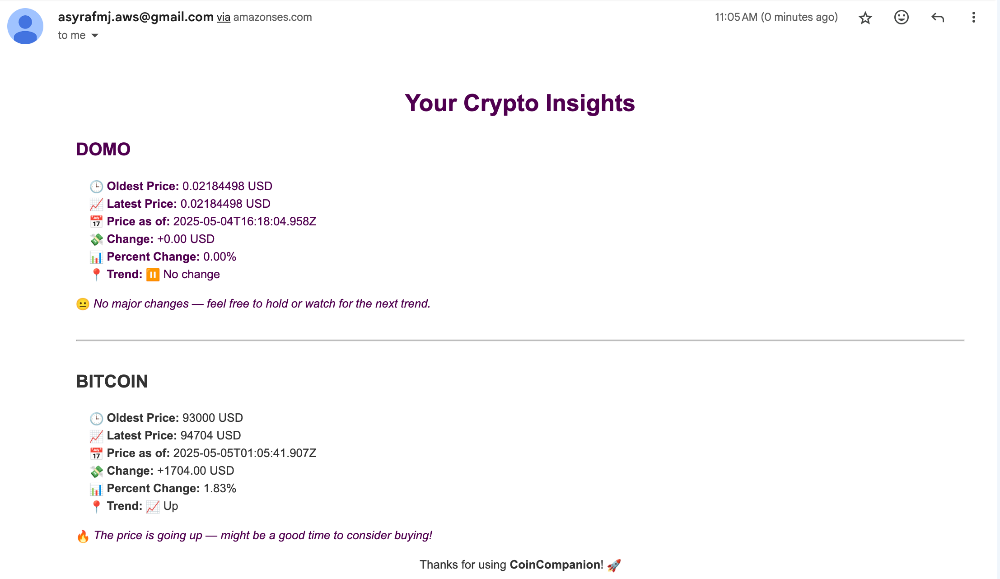
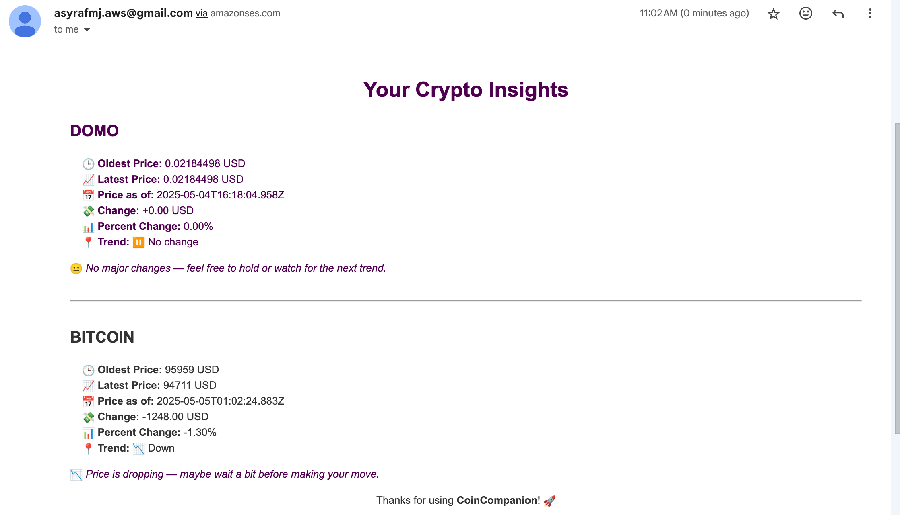

# 🚀 CoinCompanion

CoinCompanion is a serverless cryptocurrency API that delivers **real-time prices**, **price history tracking**, and **email-based summaries**. All powered by **AWS Lambda**, **API Gateway**, **DynamoDB**, and **SES**.

---

## 🏗️ System Architecture


1. **API Gateway**: Exposes public and internal endpoints.
2. **Lambda Functions**: Handle price querying, history recording, and email sending.
3. **DynamoDB**: Stores per-user historical price queries.
4. **SES (Simple Email Service)**: Sends summary emails to users.

---

## 📡 API Endpoints

### 🔹 GET `/price`

Fetches real-time price of a cryptocurrency and triggers a summary email.

**Endpoint URL**:
https://wqxzfk7834.execute-api.ap-southeast-2.amazonaws.com/prod/price

**Query Parameters**:

- `email` (required): Your email address
- `coin` (required): Coin ID (e.g., bitcoin, ethereum)

  Please refer to the list of supported coin IDs [here](https://github.com/asyrafjamil/coincompanion/blob/main/functions/query-crypto-price/coins.json).

**Expected Outcome**:

- **First-time Query**:  
  If there is not enough data (i.e., less than 2 data points for the queried coin), the email will indicate:  
  **"Not enough data to generate insights."**

- **Subsequent Queries**:  
  After having more than 2 data points, the email will include analytics insights such as:
  - **Up**: If the coin's value has increased compared to the previous data point.
  - **Down**: If the coin's value has decreased compared to the previous data point.
  - **No Change**: If the coin's value has remained the same as the previous data point.

This way, you'll be able to receive insights once there's enough data to generate meaningful analysis.

**Example**:

```bash
curl "https://wqxzfk7834.execute-api.ap-southeast-2.amazonaws.com/prod/price?email=asyraf@example.com&coin=bitcoin"
```

---

## ✉️ Email Output

After calling `/price`, an email will be sent via SES with:

- Queried coin and current price
- Timestamp
- Analytics insights based on your preferred coins, providing a detailed view of the coins' recent performance.
- Friendly, branded layout

Please note that since SES is currently in **sandbox mode**, the email may end up in your **spam** folder. To ensure smooth delivery, please let me know your email address so I can configure it in SES to whitelist your account and ensure you receive the email properly.

### Example Email Outputs:

#### 📈 When the Price is Going Up:

  
_Example of the email when the price is increasing, showing a positive trend._

---

#### 📉 When the Price is Dropping or Showing No Major Change:

  
_Example of the email when the price is either dropping or there are no significant changes in the market._

---

## 🧪 Local Testing

You can test locally using [AWS SAM CLI](https://docs.aws.amazon.com/serverless-application-model/latest/developerguide/serverless-sam-cli.html).

```bash
sam local invoke "GetCryptoPriceFunction" --event events/queryCryptoPriceSample.json
```

Place test events in the `events/` folder.

---

## 🛠️ Tech Stack

- **Runtime**: Node.js (AWS Lambda)
- **Infrastructure as Code**: AWS SAM
- **Database**: AWS DynamoDB
- **CI/CD**: GitHub Actions
- **Email Service**: AWS SES

---

## 🚀 What's Next: The Future of CoinCompanion

We're just getting started, and there's a lot more on the horizon! Here’s a sneak peek into the groundbreaking features we’re planning:

- **Automated Scheduler**:  
  CoinCompanion will soon include a scheduler that fetches cryptocurrency data automatically at dynamic intervals based on the CoinGecko API’s frequency. This ensures you stay updated with minimal effort, making your experience seamless and hands-off.

- **Enhanced API Security**:  
  To ensure your data remains safe and sound, we’re ramping up security for the API Gateway. Expect:
  - **Rate Limiting**: To prevent abuse and maintain system stability, we’ll be introducing rate limits on API calls.
  - **Token-based Authentication**: For internal API calls, we’ll require secure tokens, ensuring that only authorized requests can access sensitive data and features.

---

_🧠 Engineered by Asyraf_
